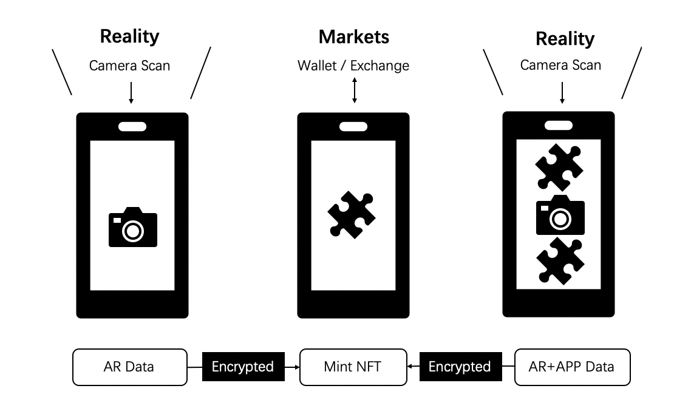

# AR-DAO Whitepaper

## Introduction

AR-DAO一个让用户通过增强现实（AR）铸造NFT并参与不同游戏的去中心化自治组织（DAO）。AR-DAO开源了视觉识别算法的代码框架并应用于各类增强现实场景。通过向智能合约传输加密后的（不可篡改性）场景数据，通过伪随机的生成NFT。应用层可以为这些NFT定义不同的数值属性，从而让链游程序具备丰富的可玩性。我们将基于我们的开源代码实现首个应用层。

## Design Principal

AR-DAO的核心定位是硬件通信层的协议，它兼容区块链的EVM（Ethereum Virtual Machine）而可被智能合约运行在EVM兼容的区块链上来确保数据上的不可篡改。AR-DAO可以通过DAO组织化的管理来不断提升其性能和应用范围的升级，这意味着它需要开源，并且在算法优化、识别精度、接口丰富上不断获得来自不同开发者们的贡献。AR-DAO允许应用层的开发者们将其商用，我们的初版代码将开放 GPL2.0 级别开源。AR-DAO会采用深度学习，从而适应更多潜在的应用场景。

总结就是：

- AR-DAO将作为兼容EVM的通信层协议被设计；
- AR-DAO将与社区同步维护开发和升级；
- AR-DAO将开放GPL2.0；
- AR-DAO支持深度学习，深度3D场景融合；

## DAO

<!--- dao -
https://baijiahao.baidu.com/s?id=1737766522531225106&wfr=spider&for=pc 
--->

AR-DAO需要一定程度的通过商用来维持DAO组织的运转。这也意味着开发AR-DAO的创始团队将推出应用层程序，并结合DAO的经济模型设计来推动DAO组织的早期发展。

## AR-DAO的架构

AR-DAO的组织架构较为简单，基金会提供最早的代码开发所需要的资金支持，并为早期团队管理应用募集的资金，而对应的Token分配将以悬赏的方式奖励给开发者，并且一定贡献的开发者将进入技术委员会，参与DAO的治理，AR-DAO不阻止第三方使用我们的开源协议进行程序开发。作为社区和用户将通过应用层的交互获得一定的应用经济模型本身的奖励，并且同样可以参与治理并为社区的想法做出贡献。

- DAO Framework

--> [DAO-core](./DAO-core) @blockchainsllc/DAO

---

## AR-DAO Application

AR-DAO的第一个应用程序将是一款结合增强现实的区块链游戏产品。并且分阶段实现其主要功能，核心的功能包含：

- 通过增强现实捕获NFT，并可在第三方市场交易，AR-DAO将收取NFT每笔交易的5%的手续费；
- 捕获的NFT收藏卡片将被产品团队赋予一定的游戏战斗数值和稀有度，并通过一款战斗游戏来捕获新的稀有卡片；
- 游戏将结合Play-2-Earn的经济模型，一定程度的奖励不同活跃度贡献的用户；
- 通过增强现实捕获NFT将会在社交圈广泛的传播，增强次元时代的社交属性；
- 游戏将丰富道具市场，增加token的内部循环，提高游戏的可玩性。

我们的市场团队将会逐步公布应用开发的计划和市场推广计划。

### AR Capture

- First Encrypted AR+DAPP

  
- ar-cutpaste
  

  --> [AR Capture](./ar-cutpaste) @cyrildiagne/ar-cutpaste/
- Mobile-NeRF

  --> [mobilenerf](./mobilenerf) @google-research

  

  [**Check it out on web !**](https://storage.googleapis.com/jax3d-public/projects/mobilenerf/mobilenerf_viewer_mac/zdeferred_ff_mac.html?obj=fern)

  
  
  

link:

- https://mobile-nerf.github.io/
- https://github.com/dunbar12138/DSNeRF
- https://github.com/kwea123/nerf_pl

### An AR-DAO Application Case（demo）

<h1>  <a href="https://github.com/ScanCan">ScanCan</a> </h1>

<b><i>告别二维码，同样能“扫一扫”！</i></b>
<!--

-->

扫一扫，告诉你想知道的全部

一个基于AR-DAO手机AR获取、分享建立价值的AR+DAPP社区应用。通过相机扫描对应于现实生活场景的AR内容，创建对应NFT上链，社区分享形成自然价值的新一代AR-DAPP应用。

### Capture to Earn

与现实互动的游戏或许具备可玩性，并且极有可能成为一种时尚，户外爱好者们可以选择行动起来去获得自己的收藏品。我们认为奖励这种行为是构建AR-DAO Application的基础。而AR-DAO最初的算法是提供分析后的加密数据包给到智能合约，并且分析和深度学习环境中的数据，而现实与游戏的数据契合，一定程度上是玩家对于画面想象力的共识，这种共识会提高未来AR-DAO Application推出更加符合玩家体验的收藏品。

伴随着捕捉并铸造卡片的付费行为，在被用户认可价值的同时，应用程序也会奖励用户一定的代币作为奖励。无论是mint出来的卡片还是代币，都将可以与区块链世界中的其他玩家或应用进行交换。

---

## AR-DAO Open Source

### Architecture

待定，demo：

---

# 展望

作为一个开源协议，AR-DAO的未来很难被定义，我们也不确定他们最终会走向何方。但AR-DAO在建设初期的使命提供加密行业的增强现实基础设施服务，愿景是建立一个元宇宙增强现实去中心化自治组织。未来AR-DAO可能会成为；

- 提供加密行业增强现实的基础设施服务；
- 元宇宙算法协议的代码托管仓库；
- 元宇宙应用层服务平台；
- 元宇宙乌托邦经济体。

# More infos

- Starting a DAO: The Definitive Guide to Creating a web3 Community. https://www.alchemy.com/overviews/the-definitive-guide-to-starting-a-dao
- DAO是什么,怎么创建一个DAO？https://zhuanlan.zhihu.com/p/451858104

 

